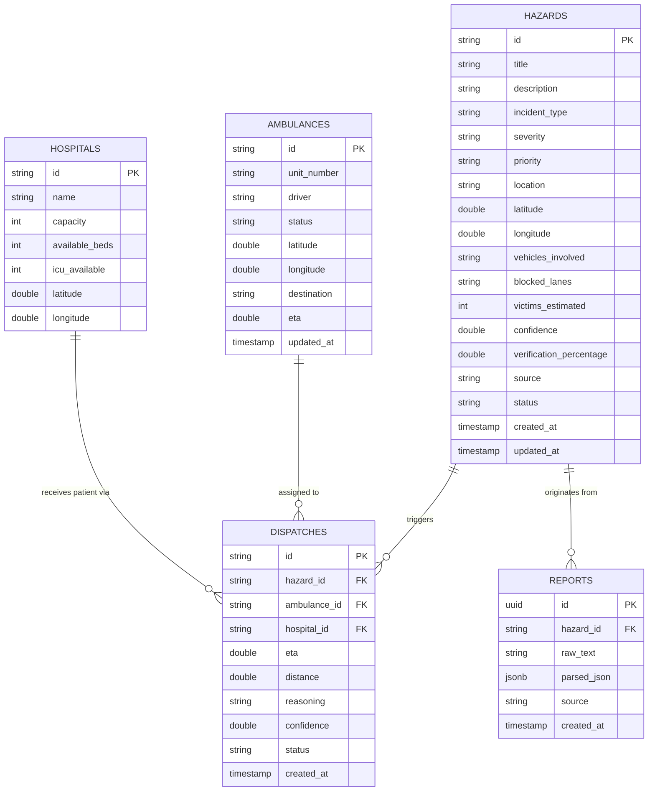

# SirensClear Phase 4 Technical Documentation

## 1. Overview & Architecture

SirensClear Phase 4 establishes a robust, decoupled repository pattern connecting the Next.js 16 App Router UI with a Supabase PostgreSQL backend and Realtime broadcast layer.

```
[ UI Components ]
      │
      ▼
[ Repository Services ] (HazardService, DispatchService, AmbulanceService, HospitalService)
      │
      ▼
[ Low-Level Supabase API ] (lib/supabase/*)
      │
      ▼
[ Supabase PostgreSQL + Realtime Channels ]
```

---

## 2. Folder Architecture

- `database/`: SQL DDL scripts (`create_tables.sql`) and initial seed data (`seed.sql`).
- `types/database.ts`: Strict TypeScript interfaces for every database table (`HazardDbRow`, `DispatchDbRow`, `AmbulanceDbRow`, `HospitalDbRow`, `ReportDbRow`) and standardized service response wrappers (`ServiceResponse<T>`).
- `lib/supabase/`: Low-level Supabase client operations and raw realtime channel listeners (`hazards.ts`, `dispatch.ts`, `ambulances.ts`, `hospitals.ts`, `reports.ts`).
- `services/`: Clean repository service abstractions wrapping database CRUD operations and transparent fallback logic (`HazardService`, `DispatchService`, `AmbulanceService`, `HospitalService`).
- `components/ai/`: UI components rendered in the Live Dashboard command grid.

---

## 3. Database Schema & ER Diagram



---

## 4. End-to-End Data & Realtime Flow

### Step-by-Step Data Flow: Incident Creation

1. **User Action**: Dispatcher inputs unformatted emergency text in `AIIncidentAnalyzer`.
2. **Deterministic NLP Parsing**: Text is evaluated locally via `parseEmergencyReportMock()`, extracting parameters (incident type, severity, priority, location, vehicles, victims).
3. **Database Insertion**:
   - `HazardService.createHazardFromParsedIncident()` creates a record in `reports` table storing `raw_text` and `parsed_json`.
   - Simultaneously creates a record in `hazards` table with status `Active`.
4. **Realtime Broadcast & UI Reaction**:
   - Supabase PostgreSQL trigger fires an `INSERT` payload over the WebSocket channel `public:hazards_realtime_channel`.
   - `HazardFeed` receives the realtime payload, deduplicates by ID, prepends the new hazard card with Framer Motion entry, and triggers a Sonner toast notification.
   - `AIInsights` recalculates live critical incident count and confidence averages dynamically.

---

## 5. Service Layer Responsibilities

- **Zero Direct UI Queries**: UI components call service methods exclusively (e.g., `HazardService.getAllHazards()`).
- **Standardized Service Responses**: Every service call returns:
  ```typescript
  interface ServiceResponse<T> {
    data: T | null;
    error: string | null;
    loading: boolean;
    status: "loading" | "success" | "empty" | "error";
    isFallback?: boolean;
  }
  ```
- **Transparent Fallback Protection**: If Supabase is unreachable or unpopulated, services automatically fall back to the pre-seeded mock dataset so the UI remains 100% operational.
- **Subscription Lifecycle**: `useEffect` hooks cleanly invoke returned cleanup functions on component unmount, preventing memory leaks or duplicate subscription listeners.
